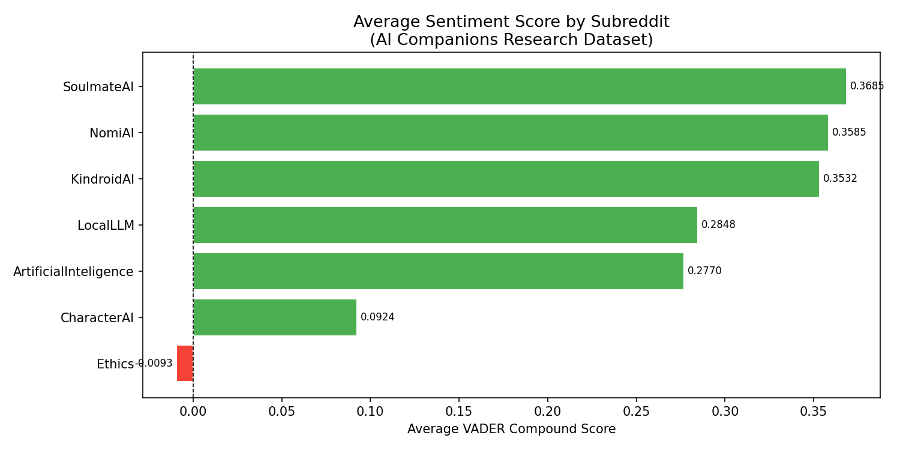
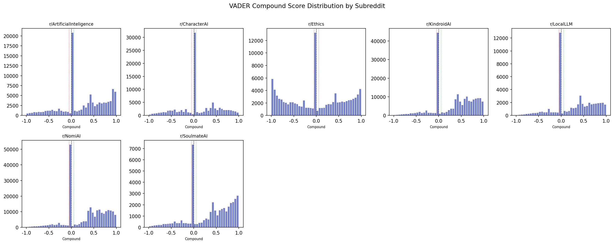

# The Human-AI Connection
### Sentiment and Ethics of AI Companions on Reddit

> A large-scale NLP study of how users across seven Reddit communities emotionally express and debate AI companionship — drawn from 816,827 comments spanning fifteen years of public discourse.

---

## Overview

This project analyzes Reddit data to explore three questions:

- How do emotional tones differ across AI companion communities (e.g. r/replika, r/CharacterAI) versus reflective communities (e.g. r/Ethics)?
- What words characterize *negative* discourse in AI companion spaces compared to ethics discourse?
- What does the distribution of sentiment scores reveal about emotional investment and the divide between lived experience and public debate?

Full findings are in Human_AI_Connection_Case_Study.pdf.
---

## Key Results

| Metric | Value |
|---|---|
| Raw comments scanned | 5,170,000+ |
| Communities analyzed | 7 |
| Sample used for sentiment analysis | 816,827 comments |
| Sentiment method | VADER (rule-based NLP) |
| Dataset span | ~15 years of Reddit history |

**Overall sentiment distribution:** 58.5% Positive · 23.0% Neutral · 18.4% Negative

**Average VADER compound score by subreddit (−1 to +1 scale):**

| Subreddit | Avg Score | % Positive | % Negative |
|---|---|---|---|
| r/SoulmateAI | +0.3685 | 66.7% | 14.9% |
| r/NomiAI | +0.3585 | — | — |
| r/KindroidAI | +0.3532 | — | — |
| r/LocalLLM | +0.2848 | — | — |
| r/ArtificialIntelligence | +0.2770 | — | — |
| r/CharacterAI | +0.0924 | 39.7% | 27.9% |
| r/Ethics | −0.0093 | 43.5% | 42.5% |

**Core finding:** Companion-focused communities score ~0.36 on average; r/Ethics is the only community with a negative average at −0.01. The gap reflects a measurable divide between users *living with* AI companions and communities *debating* them from the outside.

**TF-IDF analysis of negative comments** reveals that the two communities' negativity has fundamentally different sources:
- **r/CharacterAI:** Top negative terms are platform-specific grievances — the platform name itself, "moderators", "bot", "chat" — indicating frustration directed at the *platform*, not the AI.
- **r/Ethics:** Top negative terms are abstract moral vocabulary — "wrong", "unethical", "death", "life", "right" — the language of ethical debate about hypotheticals and principles.





---

## Dataset

**Source:** [Pushshift Reddit Archive](https://academictorrents.com/details/56aa49f9653ba545f7d1e9dac0e1a7ddd9de79c7) (`.zst` compressed dumps)

**Subreddits targeted by the extraction pipeline (10):**
`r/Ethics` · `r/Replika` · `r/CharacterAI` · `r/KindroidAI` · `r/SoulmateAI` · `r/LocalLLM` · `r/Singularity` · `r/SocialAnxiety` · `r/NomiAI` · `r/ArtificialIntelligence`

**Communities with sufficient data for analysis (7):**
r/SoulmateAI · r/NomiAI · r/KindroidAI · r/LocalLLM · r/ArtificialIntelligence · r/CharacterAI · r/Ethics

**Sampling strategy:**
- Small communities (r/SoulmateAI, r/Ethics, r/KindroidAI, r/NomiAI): all available comments retained
- Large communities (r/ArtificialIntelligence, r/CharacterAI, r/LocalLLM): capped at 100,000 rows each for comparability

**Data not included in this repository.** The raw `.zst` files and full filtered CSVs exceed GitHub's file size limits. Small samples (100 rows each) are in [`outputs/samples/`](outputs/samples/) for inspection.

---

## Methods

```
Raw .zst Archives (multi-GB, 5.17M comments)
        │
        ▼  extract_reddit_research.py
        │  • Streams .zst files in-memory — no disk extraction
        │  • Filters by subreddit (case-insensitive)
        │  • Drops [deleted] and [removed] content
        ▼
reddit_submissions_filtered.csv
reddit_comments_filtered.csv
        │
        ▼  analyze_reddit_dataset.py
        │  • Row counts and subreddit distribution
        │  • Date range and text quality metrics
        ▼
Console summary + 100-row samples
        │
        ▼  sentiment_analysis.py
        │  • Stratified sampling (all rows from small communities;
        │    100k cap on large communities)
        │  • VADER compound scoring on 816,827 comments
        │  • Subreddit-level comparative analysis
        │  • TF-IDF key terms on Negative-sentiment comments
        │  • Visualizations: bar chart + per-subreddit histogram grid
        ▼
sentiment_summary_results.csv
outputs/figures/sentiment_by_subreddit.png
outputs/figures/sentiment_distribution.png
```

---

## Project Structure

```
human-ai-connection/
├── README.md
├── requirements.txt
├── .gitignore
├── config.py                        ← all paths, subreddit lists, constants
│
├── extract_reddit_research.py       ← Step 1: extract from .zst archives
├── analyze_reddit_dataset.py        ← Step 2: dataset summary statistics
├── sentiment_analysis.py            ← Step 3: VADER + TF-IDF + figures
│
├── outputs/
│   ├── figures/
│   │   ├── sentiment_by_subreddit.png
│   │   └── sentiment_distribution.png
│   └── samples/
│       ├── sample_submissions.csv   ← 100 rows, safe to inspect
│       └── sample_comments.csv
│
└── report/
    └── Human_AI_Connection_Case_Study.pdf
```

---

## Reproducing the Analysis

### 1. Install dependencies
```bash
pip install -r requirements.txt
```

### 2. Configure the data directory

The raw `.zst` archives are required for Step 1 only. The default path is set in `config.py` and can be overridden without editing code:

```bash
# Windows
set DATA_DIR=D:\path\to\your\zst\files

# macOS / Linux
export DATA_DIR=/path/to/your/zst/files

# Or pass directly as a flag
python extract_reddit_research.py --data-dir /path/to/zst/files
```

### 3. Run the pipeline in order

```bash
python extract_reddit_research.py    # hours — streams and filters 5M+ comments
python analyze_reddit_dataset.py     # minutes — summary statistics
python sentiment_analysis.py         # 30–60 min — VADER + TF-IDF + figures
```

Steps 2 and 3 only require the CSV outputs from Step 1, not the original archives.

---

## Limitations

- **Temporal sampling bias:** The reservoir sampler fills from the earliest records in each time-ordered CSV. Recent posts in large subreddits (r/CharacterAI, r/LocalLLM) are underrepresented in the 100k sample.
- **VADER is a lexicon heuristic:** VADER (2014) does not handle sarcasm, compound negation, or domain-specific slang reliably. It cannot distinguish "I love this AI" from "I love this" semantically. Several extreme-magnitude scores in the corpus result from spam-style repetition (single words repeated hundreds of times) rather than genuine sentiment.
- **Self-selected population:** Only users who posted publicly and stayed in the community are captured. People who used these products and stopped participating are not represented. The +0.36 average reflects the expressed sentiment of users who remained.
- **Platform-only scope:** This is Reddit data. Findings describe discourse on one platform and should not be generalized to AI companion users as a population.
- **Correlation, not causation:** Associations between subreddit membership and sentiment polarity do not imply that AI companion use causes any emotional outcome.

---

## Future Work

- **Temporal analysis:** Track sentiment change over time around model updates and platform policy changes — the report notes that post-update language in r/CharacterAI reads like grief.
- **Transformer-based validation:** A fine-tuned classifier on companion-community vocabulary would better handle the irony, slang, and emotional complexity VADER misses.
- **Submission-level analysis:** Apply the same pipeline to `reddit_submissions_filtered.csv` to compare original posts versus comment discourse.
- **Small-N qualitative follow-up:** Pair corpus findings with interview data to anchor the language patterns in lived accounts.

---

## Tech Stack

| Tool | Purpose |
|---|---|
| `zstandard` | Stream-decompress multi-GB `.zst` archives without writing to disk |
| `pandas` | Chunked CSV processing for files exceeding available RAM |
| `nltk` (VADER) | Rule-based sentiment scoring |
| `scikit-learn` (TF-IDF) | Key term extraction per sentiment class |
| `matplotlib` | Figures |
| `tqdm` | Progress monitoring on long-running extraction passes |

---

## Ethics Note

All data is sourced from public Reddit posts via the Pushshift archive. No private or identifying information beyond publicly posted usernames is retained. The study does not target or profile individual users.

---

## Author

Author

Anita Xu
B.S. Informatics (Data Science), University of Washington

GitHub:
https://github.com/anitaxu0715